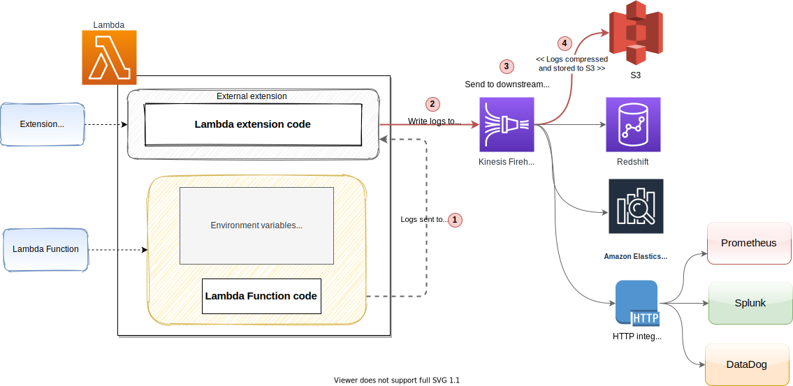

# Centralized logging with Kinesis Firehose using Lambda Extensions

## Introduction

The provided code sample shows how to get send logs directly to kinesis firehose without sending them to AWS CloudWatch

> Note: This is a simple example extension to help you investigate an approach to centralize the log aggregation. This example code is not production ready. Use it with your own discretion after testing thoroughly.

This sample extension:

* Subscribes to receive platform and function logs.
* Runs with a main, and a helper goroutine: The main goroutine registers to ExtensionAPI and process its invoke and shutdown events (see nextEvent call). The helper goroutine:
    - starts a local HTTP server at the provided port (default 1234) that receives requests from Logs API
    - puts the logs in a synchronized queue (Producer) to be processed by the main goroutine (Consumer)
* Writes the received logs to AWS Kinesis firehose

## Architecture

Here is the high level view of all the components



Once deployed the overall flow looks like below:

* On start-up, the extension registers to receive logs for `Platform` and `Function` events via a local HTTP server.
* When the extension receives these logs, it takes care of buffering the data and writing it to AWS Kinesis Firehose using direct `PUT` records

> Note: Firehose stream name gets specified as an environment variable (`AWS_KINESIS_STREAM_NAME`)

* The Kinesis Firehose stream configured part of this sample sends log directly to `AWS S3` (gzip compressed).

## Build and Deploy

AWS SAM template available part of the root directory can be used for deploying the sample lambda function with this extension

### Build

Run the following command from the root directory

```bash
sam build
```

**Output**

```bash
Building codeuri: /Users/xxx/CodeBase/aws-lambda-extensions/kinesisfirehose-logs-extension-demo/hello-world runtime: nodejs12.x metadata: {} functions: ['HelloWorldFunction']
Running NodejsNpmBuilder:NpmPack
Running NodejsNpmBuilder:CopyNpmrc
Running NodejsNpmBuilder:CopySource
Running NodejsNpmBuilder:NpmInstall
Running NodejsNpmBuilder:CleanUpNpmrc
Building layer 'KinesisFireHoseLogsApiExtensionLayer'
Running CustomMakeBuilder:CopySource
Running CustomMakeBuilder:MakeBuild
Current Artifacts Directory : /Users/xxx/CodeBase/aws-lambda-extensions/kinesisfirehose-logs-extension-demo/.aws-sam/build/KinesisFireHoseLogsApiExtensionLayer

Build Succeeded

Built Artifacts  : .aws-sam/build
Built Template   : .aws-sam/build/template.yaml

Commands you can use next
=========================
[*] Invoke Function: sam local invoke
[*] Deploy: sam deploy --guided
```

### Deploy

Run the following command to deploy the sample lambda function with the extension

```bash
sam deploy --guided
```

> Note: Either you can customize the parameters, or leave it as default to start the deployment

**Output**

```bash
CloudFormation outputs from deployed stack
-------------------------------------------------------------------------------------------------------------------
Outputs
-------------------------------------------------------------------------------------------------------------------
Key                 KinesisFireHoseLogsApiExtensionLayer
Description         Kinesis Log emiter Lambda Extension Layer Version ARN
Value               arn:aws:lambda:us-east-1:xxx:layer:kinesisfirehose-logs-extension-demo:5

Key                 BucketName
Description         The bucket where data will be stored
Value               sam-app-deliverybucket-1lrmn02k8mxbc

Key                 KinesisFireHoseIamRole
Description         Kinesis firehose IAM role
Value               arn:aws:firehose:us-east-1:xxx:deliverystream/lambda-logs-direct-s3-no-cloudwatch

Key                 HelloWorldFunction
Description         First Lambda Function ARN
Value               arn:aws:lambda:us-east-1:xxx:function:kinesisfirehose-logs-extension-demo-function
-------------------------------------------------------------------------------------------------------------------
```

## Testing

You can invoke the Lambda function using the following CLI command

```bash
aws lambda invoke \
    --function-name "<<function-name>>" \
    --payload '{"payload": "hello"}' /tmp/invoke-result \
    --cli-binary-format raw-in-base64-out \
    --log-type Tail
```

>Note: Make sure to replace `function-name` with the actual lambda function name

The function should return ```"StatusCode": 200```, with the below output

```bash
{
    "StatusCode": 200,
    "LogResult": "<<Encoded>>",
    "ExecutedVersion": "$LATEST"
}
```

After invoking the function and receiving the shutdown event, you should now see log messages from the example extension written to an S3 bucket.

* Login to AWS console:
    * Navigate to the S3 folder (`BucketName`) available part of the SAM output.
    * We can see the logs successly written to the S3 bucket, partitioned based on date
  
  
    * Navigate to "/aws/lambda/${functionname}" log group inside AWS CloudWatch service.
    * We shouldn't see any logs created under this log group as we have denied access to write any logs from the lambda function.
  

## Cleanup

Run the following command to delete the stack, use the correct stack names if you have changed them during sam deploy

```bash
aws cloudformation delete-stack --stack-name sam-app
```  

## Resources

* [Using AWS Lambda extensions to send logs to custom destinations](https://aws.amazon.com/blogs/compute/using-aws-lambda-extensions-to-send-logs-to-custom-destinations/)
* [Ingest streaming data into Amazon Elasticsearch Service within the privacy of your VPC with Amazon Kinesis Data Firehose](https://aws.amazon.com/blogs/big-data/ingest-streaming-data-into-amazon-elasticsearch-service-within-the-privacy-of-your-vpc-with-amazon-kinesis-data-firehose/)
* [Example Logs API Extension in Go](https://github.com/aws-samples/aws-lambda-extensions/tree/main/go-example-logs-api-extension).

## Conclusion

This extension provides an approach to streamline and centralize the logs using Kinesis firehose.
