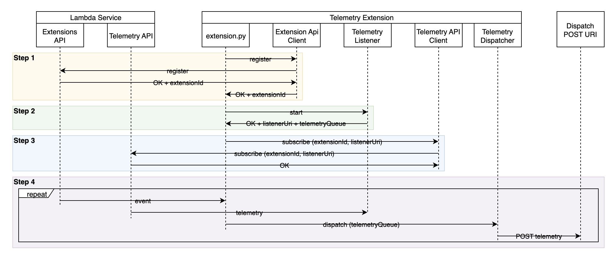

# Example Telemetry API Extension in Python

The provided code sample demonstrates how to get a basic Telemetry API extension written in Python up and running.

> This is a simple example extension to help you start investigating the Lambda Telemetry API. This example code is not production ready. Use it with your own discretion after testing thoroughly.

This sample extension: 
1. Registers the extension with Lambda Extensions API (see `python_example_telemetry_api_extension/extensions_api_client.py`)
2. Starts a local HTTP server to receive incoming telemetry events from the Telemetry API (see `python_example_telemetry_api_extension/telemetry_http_listener.py`)
3. Subscribes to the Telemetry API to start receiving incoming telemetry events (see `python_example_telemetry_api_extension/telemetery_api_client.py`)
4. Receives telemetry events, batches them, and dispatches to a pre-defined URI via POST requests (see `python_example_telemetry_api_extension/telemetry_dispatcher.py`)




Note that Step 4 is asynchronous in nature. The function is thawed to process the incoming event, and new telemetry might arrive either before or after dispatching existing telemetry. In case of the latter, the newly arrived telemetry will be kept in the telemetry queue and dispatched when processing next event. Depending on buffering configuration you pass to the Telemetry API during subscription, you might get either zero, one, or multiple requests from Telemetry API to the telemetry listener in a single function invocation. 

The code is heavily instrumented with logs so you'll be able to see the Telemetry API extension lifecycle messages as you're learning to implement one. 

There are two major components to this sample:

* `./extensions/` - This directory should be extracted to `/opt/extensions` where the Lambda platform will scan for executables to launch extensions
* `./python_example_telemetry_api_extension/` - This directory should be extracted to `/opt/python_example_telemetry_api_extension`, which is referenced by the `./extensions/python_example_telemetry_api_extension` executable and includes a Python executable along with all of its necessary dependencies.

Install the extension dependencies locally, which will be mounted along with the extension code.
```bash
chmod +x python_example_telemetry_api_extension/extension.py 
pip3 install -r python_example_telemetry_api_extension/requirements.txt -t ./python_example_telemetry_api_extension/
```

## Layer Setup Process
The extension .zip file should contain a root directory called `extensions/`, where the extension executables are located, and another root directory called `python_example_telemetry_api_extension/`, where the core logic of the extension and its dependencies are located. 

Creating zip package for the extension:

```bash
chmod +x extensions/python_example_telemetry_api_extension
zip -r extension.zip extensions python_example_telemetry_api_extension
```

Publish a new layer using the `extension.zip` using below command. The output should provide you with a layer ARN. 

```bash
aws lambda publish-layer-version \
    --layer-name "python_example_telemetry_api_extension" \
    --zip-file "fileb://extension.zip"
```


Note the `LayerVersionArn` that is produced in the output. eg. 

```
LayerVersionArn: arn:aws:lambda:<region>:123456789012:layer:<layerName>:1
```

Add the newly created layer version to a Python runtime Lambda function.

```bash
aws lambda update-function-configuration \
    --function-name <your function name> \
    --layers <layer arn>
```

## Function Invocation and Extension Execution

Configure the extension by setting below environment variables in your Lambda Function.

* `DISPATCH_POST_URI` - the URI you want telemetry to be posted to. If not specified you will still be able to observe extension work via produced logs in CloudWatch, but telemetry events will be discarded. 
* `DISPATCH_MIN_BATCH_SIZE` - optimize dispatching telemetry by telling the dispatcher how many log events you want it to batch. On function invoke the telemetry will be dispatched to `DISPATCH_POST_URI` only if number of log events collected so far is greater than `DISPATCH_MIN_BATCH_SIZE`. On function shutdown the telemetry will be dispatched to `DISPATCH_POST_URI` regardless of how many log events were collected so far. 
